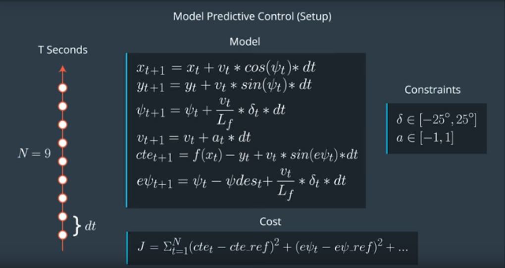
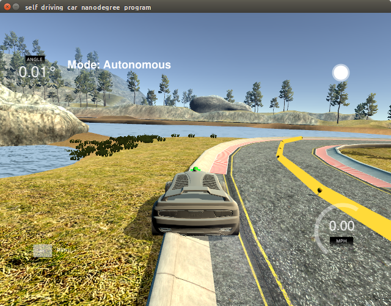

# CarND-Controls-MPC
Self-Driving Car Engineer Nanodegree Program

---

## Dependencies

* cmake >= 3.5
 * All OSes: [click here for installation instructions](https://cmake.org/install/)
* make >= 4.1(mac, linux), 3.81(Windows)
  * Linux: make is installed by default on most Linux distros
  * Mac: [install Xcode command line tools to get make](https://developer.apple.com/xcode/features/)
  * Windows: [Click here for installation instructions](http://gnuwin32.sourceforge.net/packages/make.htm)
* gcc/g++ >= 5.4
  * Linux: gcc / g++ is installed by default on most Linux distros
  * Mac: same deal as make - [install Xcode command line tools]((https://developer.apple.com/xcode/features/)
  * Windows: recommend using [MinGW](http://www.mingw.org/)
* [uWebSockets](https://github.com/uWebSockets/uWebSockets)
  * Run either `install-mac.sh` or `install-ubuntu.sh`.
  * If you install from source, checkout to commit `e94b6e1`, i.e.
    ```
    git clone https://github.com/uWebSockets/uWebSockets
    cd uWebSockets
    git checkout e94b6e1
    ```
    Some function signatures have changed in v0.14.x. See [this PR](https://github.com/udacity/CarND-MPC-Project/pull/3) for more details.

* **Ipopt and CppAD:** Please refer to [this document](https://github.com/udacity/CarND-MPC-Project/blob/master/install_Ipopt_CppAD.md) for installation instructions.
* [Eigen](http://eigen.tuxfamily.org/index.php?title=Main_Page). This is already part of the repo so you shouldn't have to worry about it.
* Simulator. You can download these from the [releases tab](https://github.com/udacity/self-driving-car-sim/releases).
* Not a dependency but read the [DATA.md](./DATA.md) for a description of the data sent back from the simulator.


## Basic Build Instructions

1. Clone this repo.
2. Make a build directory: `mkdir build && cd build`
3. Compile: `cmake .. && make`
4. Run it: `./mpc`.

## Project Details

I have implemented Model Predictive Control to drive a car simulator across a curvy track. I used Kinematic Model to simulate the reaction of car. This means my model simplifies the model as we do not need to consider weight of car, gravity, tires, air drag and other forces which would be considered in a Dynamic model.

**Final output**: Here we can see the simulated car driving around a track in reasonably stable way. [YouTube video](https://youtu.be/AbgKPs0KNDo) 


### Model Description

[x,y,ψ,v] is the state of the car, L​f​​ is a physical characteristic of the vehicle, and [δ,a] are the actuators of my model. δ is used to represent the steering wheel. In order to avoid sharp turns, there is a constraint of [-25 ,25] on this. Similarly, brake has a range of [-1,1]. Negative number is used to represent braking which position number is the acceleration of the model.Cross track error (cte) and ψ error (eψ) were also used to build the cost function.

Following image from lecture demonstrates the Model equations in concise way:



WHile optimizing the model for maximum speed, I had to expriment with multiple hyperparameters. The model has a predefined latency of 100ms which accounts for actuators latency in real world. As such the state of car was projected 100ms into future. 
I used Time step duration of 0.1 ms which matches the actuator response time. Also, for time steps I experimented with multiple values. However, if we keep more values for prediction, the model was geting into higher oscillation and even stopped working after few seconds. Here is an example of stopped car with N=30. 



For a stable run, I had to settle or 2sec duration. Which means my N was 20 and dt was 0.1.

I tuned the cost function parameters by trial-and-error method.The best speed and stability was achieved with following cost parameters. It was possible to complete the track at higher speed by increasing CTE_W but car was oscillating and going out of center far too much. 

const double  CTE_W = 2.0;
const double EPSI_W=  1;
const double V_W = 1;
const double  DELTA_W  =10000;
const double  A_W =  50;
const double  DDELTA_W = 1;
const double DA_W =  1;

